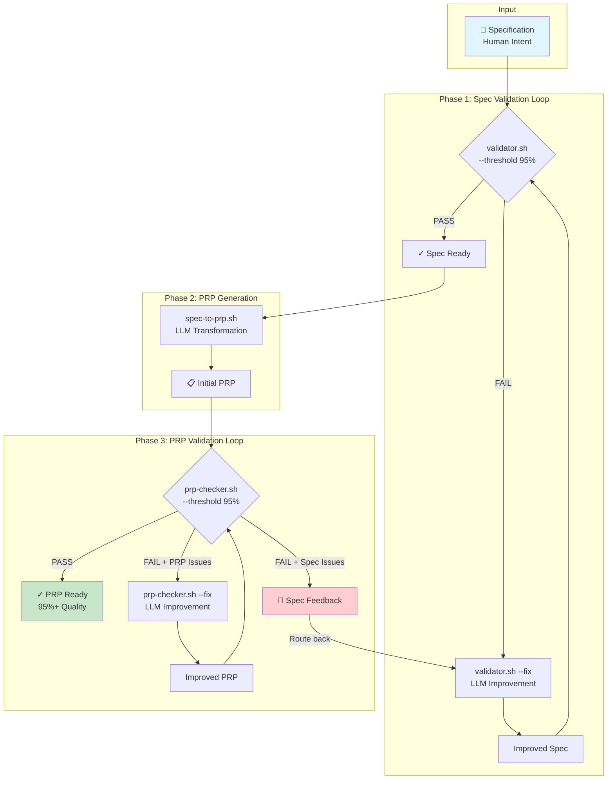
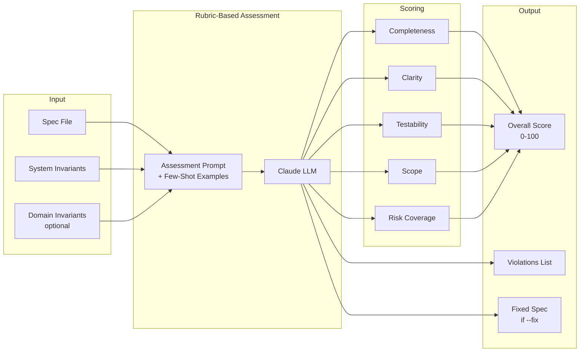
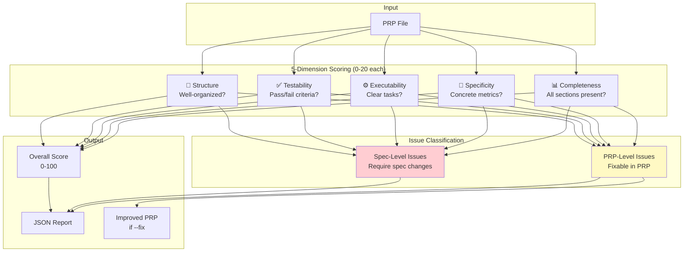
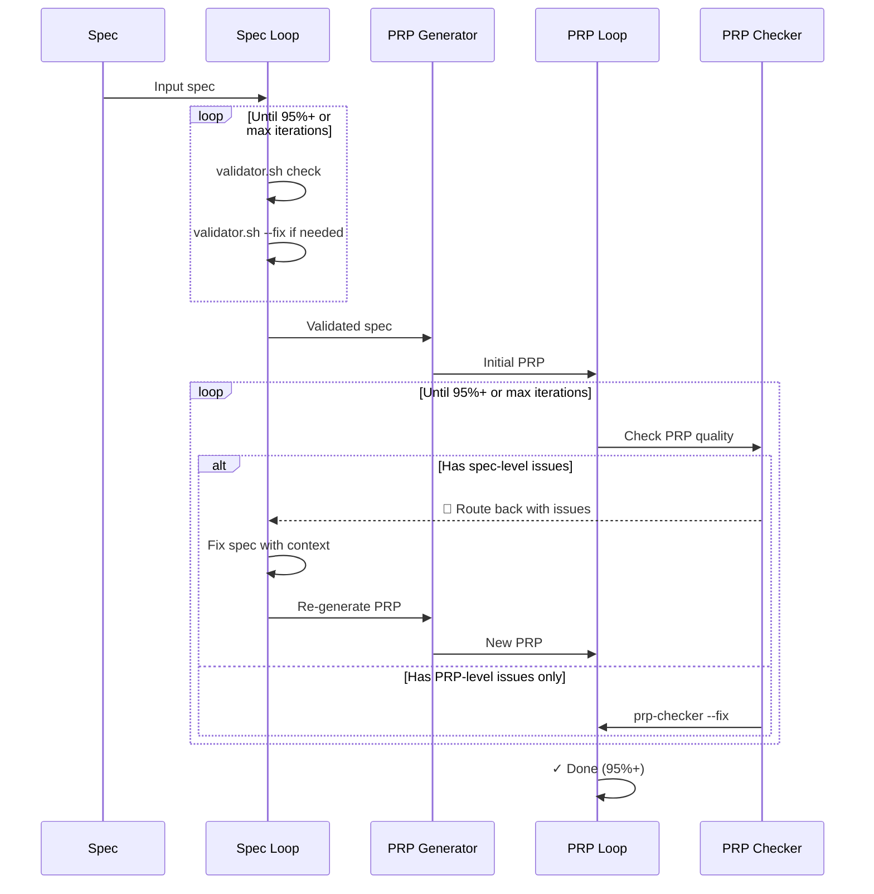
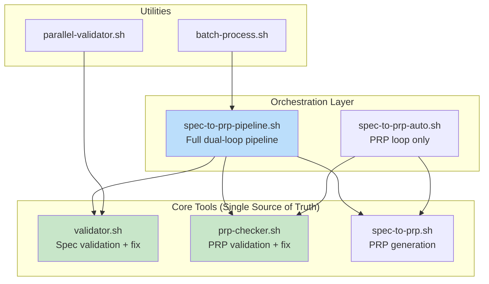

# Design Ops Pipeline Architecture

## Overview

The Design Ops pipeline transforms human-written specifications into agent-executable PRPs (Product Requirements Prompts) through iterative validation and improvement loops.

## Main Pipeline Flow



## Validator Architecture (LLM-Powered)



## PRP Checker Architecture (5-Dimension Rubric)



## Spec Feedback Loop Detail



## Tool Hierarchy



## Key Design Principles

1. **Single Source of Truth**: Fix logic lives in `validator.sh --fix` and `prp-checker.sh --fix`
2. **Feedback Loop**: PRP issues can route back to spec improvement
3. **LLM-Powered**: Rubric-based assessment replaces regex pattern matching
4. **Few-Shot Examples**: Calibrate model on what violations AND false positives look like
5. **Bounded Loops**: Max iterations prevent infinite cycles (spec feedback limited to 2)

## File Locations

```
~/.claude/plugins/design-ops/
├── enforcement/
│   ├── spec-to-prp-pipeline.sh  # Main orchestrator
│   ├── spec-to-prp-auto.sh      # PRP-only loop
│   ├── spec-to-prp.sh           # Generation
│   ├── validator.sh             # Spec validation
│   ├── prp-checker.sh           # PRP validation
│   └── batch-*.sh               # Utilities
├── templates/
│   └── prp-base.md              # PRP template
├── prompts/
│   ├── spec-transformation.md
│   ├── prp-review.md
│   └── metadata-extraction.md
└── docs/
    └── architecture-diagram.md  # This file
```
