# Design Ops Pipeline Architecture

## Overview

The Design Ops pipeline transforms human-written specifications into agent-executable PRPs (Product Requirements Prompts) through iterative validation and improvement loops.

## Main Pipeline Flow

```mermaid
flowchart TB
    subgraph Input
        SPEC[📄 Specification<br/>Human Intent]
    end

    subgraph Phase1["Phase 1: Spec Validation Loop"]
        V1{validator.sh<br/>--threshold 95%}
        V1 -->|PASS| P1_DONE[✓ Spec Ready]
        V1 -->|FAIL| FIX1[validator.sh --fix<br/>LLM Improvement]
        FIX1 --> SPEC_IMPROVED[Improved Spec]
        SPEC_IMPROVED --> V1
    end

    subgraph Phase2["Phase 2: PRP Generation"]
        GEN[spec-to-prp.sh<br/>LLM Transformation]
        GEN --> PRP[📋 Initial PRP]
    end

    subgraph Phase3["Phase 3: PRP Validation Loop"]
        V2{prp-checker.sh<br/>--threshold 95%}
        V2 -->|PASS| DONE[✓ PRP Ready<br/>95%+ Quality]
        V2 -->|FAIL + PRP Issues| FIX2[prp-checker.sh --fix<br/>LLM Improvement]
        V2 -->|FAIL + Spec Issues| FEEDBACK[🔄 Spec Feedback]
        FIX2 --> PRP_IMPROVED[Improved PRP]
        PRP_IMPROVED --> V2
    end

    SPEC --> V1
    P1_DONE --> GEN
    PRP --> V2
    FEEDBACK -->|Route back| FIX1

    style SPEC fill:#e1f5fe
    style DONE fill:#c8e6c9
    style FEEDBACK fill:#ffcdd2
```



## Validator Architecture (LLM-Powered)


## PRP Checker Architecture (5-Dimension Rubric)

```mermaid
flowchart TB
    subgraph Input
        PRP[PRP File]
    end

    subgraph Dimensions["5-Dimension Scoring (0-20 each)"]
        D1[📊 Completeness<br/>All sections present?]
        D2[🎯 Specificity<br/>Concrete metrics?]
        D3[⚙️ Executability<br/>Clear tasks?]
        D4[✅ Testability<br/>Pass/fail criteria?]
        D5[📐 Structure<br/>Well-organized?]
    end

    subgraph Classification["Issue Classification"]
        PRP_ISS[PRP-Level Issues<br/>Fixable in PRP]
        SPEC_ISS[Spec-Level Issues<br/>Require spec changes]
    end

    subgraph Output
        SCORE[Overall Score<br/>0-100]
        JSON[JSON Report]
        IMPROVED[Improved PRP<br/>if --fix]
    end

    PRP --> D1 & D2 & D3 & D4 & D5
    D1 & D2 & D3 & D4 & D5 --> SCORE
    D1 & D2 & D3 & D4 & D5 --> PRP_ISS
    D1 & D2 & D3 & D4 & D5 --> SPEC_ISS
    PRP_ISS --> JSON
    SPEC_ISS --> JSON
    SCORE --> JSON
    PRP_ISS --> IMPROVED

    style SPEC_ISS fill:#ffcdd2
    style PRP_ISS fill:#fff9c4
```



## Spec Feedback Loop Detail

```mermaid
sequenceDiagram
    participant S as Spec
    participant VL as Spec Loop
    participant G as PRP Generator
    participant PL as PRP Loop
    participant PC as PRP Checker

    S->>VL: Input spec
    loop Until 95%+ or max iterations
        VL->>VL: validator.sh check
        VL->>VL: validator.sh --fix if needed
    end
    VL->>G: Validated spec
    G->>PL: Initial PRP

    loop Until 95%+ or max iterations
        PL->>PC: Check PRP quality
        alt Has spec-level issues
            PC-->>VL: 🔄 Route back with issues
            VL->>VL: Fix spec with context
            VL->>G: Re-generate PRP
            G->>PL: New PRP
        else Has PRP-level issues only
            PC->>PL: prp-checker --fix
        end
    end

    PL->>PL: ✓ Done (95%+)
```



## Tool Hierarchy


## Key Design Principles

1. **Single Source of Truth**: Fix logic lives in `validator.sh --fix` and `prp-checker.sh --fix`
2. **Feedback Loop**: PRP issues can route back to spec improvement
3. **LLM-Powered**: Rubric-based assessment replaces regex pattern matching
4. **Few-Shot Examples**: Calibrate model on what violations AND false positives look like
5. **Bounded Loops**: Max iterations prevent infinite cycles (spec feedback limited to 2)

## File Locations

```
~/.claude/plugins/design-ops/
├── enforcement/
│   ├── spec-to-prp-pipeline.sh  # Main orchestrator
│   ├── spec-to-prp-auto.sh      # PRP-only loop
│   ├── spec-to-prp.sh           # Generation
│   ├── validator.sh             # Spec validation
│   ├── prp-checker.sh           # PRP validation
│   └── batch-*.sh               # Utilities
├── templates/
│   └── prp-base.md              # PRP template
├── prompts/
│   ├── spec-transformation.md
│   ├── prp-review.md
│   └── metadata-extraction.md
└── docs/
    └── architecture-diagram.md  # This file
```
