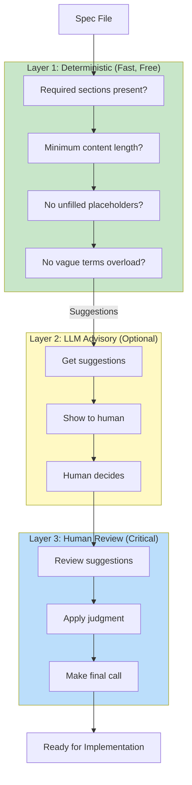

# Design Ops v3.2 - Simplified Pipeline

## Core Philosophy

> **This is a CHECKLIST ASSISTANT, not a judge.**
> It catches obvious gaps. YOU catch subtle design flaws.
> The suggestions matter more than the status.

Inspired by Rasmus Widing's PRP methodology: *"Never, ever skip the validation step"* - but the human is the final checkpoint, not the tool.

## Philosophy Change

**v2 (over-engineered):**
- LLM validates → LLM fixes → loop until 95% → repeat
- Circular reasoning: LLM agreeing with itself
- 14 files, 3700 lines, fragile JSON parsing

**v3 (simplified):**
- Deterministic checks first (fast, free, reliable)
- LLM provides suggestions (advisory only)
- Human decides and fixes
- 1 file, ~600 lines, robust Python JSON parsing

## The Workflow (Correct Order)

```
┌─────────────────────────────────────────────────────────────────┐
│  STEP 1: Write Spec (You + Claude)                              │
│  Together: Define problem, success criteria, scope              │
└─────────────────────────────────────────────────────────────────┘
                              ↓
┌─────────────────────────────────────────────────────────────────┐
│  STEP 2: Stress Test (RUN FIRST)                                │
│  Question: "Is this spec COMPLETE?"                             │
│  - Does it cover all requirements?                              │
│  - Does it handle error cases?                                  │
│  - Does it address failure modes?                               │
└─────────────────────────────────────────────────────────────────┘
                              ↓
┌─────────────────────────────────────────────────────────────────┐
│  STEP 3: Validate                                               │
│  Question: "Is this spec CLEAR?"                                │
│  - Has required sections?                                       │
│  - No vague terms?                                              │
│  - Unambiguous?                                                 │
└─────────────────────────────────────────────────────────────────┘
                              ↓
┌─────────────────────────────────────────────────────────────────┐
│  STEP 4: Generate PRP (one-shot)                                │
│  Create agent-executable PRP from validated spec                │
└─────────────────────────────────────────────────────────────────┘
                              ↓
┌─────────────────────────────────────────────────────────────────┐
│  STEP 5: Human Review (MOST IMPORTANT)                          │
│  YOU approve before implementation. Tool doesn't replace this.  │
└─────────────────────────────────────────────────────────────────┘
```

**Why this order?**
- No point polishing (validate) a spec that's missing half the requirements
- First: Do we have all the ingredients? (stress-test)
- Then: Is the recipe written clearly? (validate)
- Finally: Cook the dish (generate)

## Architecture



## Usage

```bash
# 1. STRESS TEST (run first) - Is spec complete?
./design-ops-v3.sh stress-test specs/my-feature.md

# With optional requirements/journeys files
./design-ops-v3.sh stress-test specs/my-feature.md --requirements reqs.md --journeys journeys.md

# 2. VALIDATE - Is spec clear?
./design-ops-v3.sh validate specs/my-feature.md

# 3. GENERATE PRP (one-shot, no loops)
./design-ops-v3.sh generate specs/my-feature.md

# 4. CHECK PRP quality
./design-ops-v3.sh check PRPs/my-feature-prp.md

# Quick mode (skip LLM, deterministic only)
./design-ops-v3.sh stress-test specs/my-feature.md --quick
./design-ops-v3.sh validate specs/my-feature.md --quick
```

## Example Output

```
╔═══════════════════════════════════════════════════════════════╗
║  SPEC STRESS TEST (v3.2.0) - Completeness Check               ║
╚═══════════════════════════════════════════════════════════════╝

━━━ Deterministic Coverage Checks ━━━
  ✓ Happy path mentioned
  ✓ Error cases mentioned
  ✗ Empty/null states not explicitly handled
  ✗ External failure modes not addressed (API down, timeout, offline)
  ? Concurrency not explicitly addressed (may not apply)
  ✓ Limits/boundaries mentioned

Basic Coverage: 4/6 (66%)

━━━ LLM Deep Analysis ━━━

Missing Requirements:
  ✗ Password reset flow not specified
  ✗ Session timeout handling not defined

Unaddressed Failure Modes:
  ? What if the database is unavailable?
  ? What if user's session expires mid-operation?

Critical Questions to Answer:
  1. What happens if the user loses network during upload?
  2. How should errors be displayed to the user?
  3. What's the retry policy for failed API calls?

═══════════════════════════════════════════════════════════════
  LIMITATIONS: This catches obvious gaps, not subtle design flaws.
               The suggestions above matter more than this summary.
───────────────────────────────────────────────────────────────
  Status: ITEMS TO REVIEW
  Found some potential gaps. May or may not apply to your context.
  → Review the suggestions above. You decide what's valid.

  Next step: ./design-ops-v3.sh validate specs/my-feature.md
═══════════════════════════════════════════════════════════════
Cost estimate: ~$0.0312 (2841 input + 1203 output tokens)
```

## Status Labels (Not Grades)

| Status | Meaning | Your Action |
|--------|---------|-------------|
| **NO OBVIOUS GAPS** | Basic checks passed | Still review suggestions |
| **ITEMS TO REVIEW** | Found potential issues | Review, decide what applies |
| **STRUCTURAL ISSUES** | Missing sections/placeholders | Fix structure first |
| **REVIEW REQUIRED** | Multiple gaps found | Likely needs attention |

**Important:** These are suggestions, not verdicts. The tool can't catch:
- Semantic correctness (are the requirements *right*?)
- Business logic errors
- Subtle design flaws
- Context-specific issues

## Cost Tracking

Every run shows estimated cost:
```
Cost estimate: ~$0.0234 (1523 input + 892 output tokens)
```

## What's Different

| Aspect | v2 | v3.2 |
|--------|----|----|
| Auto-fix loops | Yes (up to 5 iterations) | No (one-shot) |
| LLM role | Authoritative | Advisory |
| JSON parsing | grep/sed (fragile) | Python (robust) |
| Output | 95% score (false precision) | Suggestions + status |
| Cost visibility | None | Every run |
| Files | 14 shell scripts | 1 shell script |
| Philosophy | Tool judges | Human judges |

## Migration

v2 files are preserved but deprecated. Use v3:

```bash
# Old (deprecated)
./spec-to-prp-pipeline.sh spec.md

# New (recommended)
./design-ops-v3.sh stress-test spec.md
./design-ops-v3.sh validate spec.md
./design-ops-v3.sh generate spec.md
./design-ops-v3.sh check output.md
```

## The Key Insight

> "The value is in thinking through requirements, not in automating the validation of that thinking."

v3.2 helps you think by:
1. Catching obvious omissions (deterministic checks)
2. Suggesting improvements (LLM advisory)
3. Letting you decide (human review)

It does NOT try to:
1. Score with false precision
2. Auto-fix documents
3. Loop until an arbitrary threshold
4. Replace human judgment
5. Be the final word on spec quality

## Version History

| Version | Changes |
|---------|---------|
| 3.2.0 | Reframed output: suggestions over grades, explicit limitations |
| 3.1.0 | Added stress-test command, correct workflow order |
| 3.0.0 | Initial simplified pipeline, single file |
