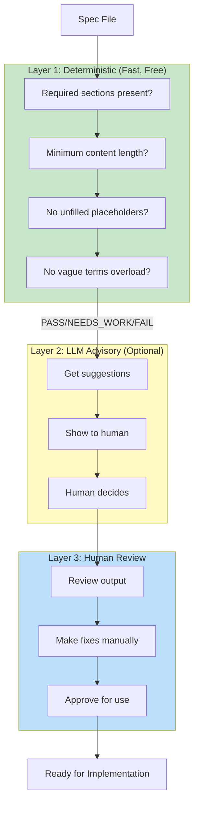

# Design Ops v3 - Simplified Pipeline

## Philosophy Change

**v2 (over-engineered):**
- LLM validates → LLM fixes → loop until 95% → repeat
- Circular reasoning: LLM agreeing with itself
- 14 files, 3700 lines, fragile JSON parsing

**v3 (simplified):**
- Deterministic checks first (fast, free, reliable)
- LLM provides suggestions (advisory only)
- Human decides and fixes
- 1 file, ~400 lines, robust Python JSON parsing

## Architecture



## Usage

```bash
# Validate a spec
./design-ops-v3.sh validate specs/my-feature.md

# Generate PRP (one-shot, no loops)
./design-ops-v3.sh generate specs/my-feature.md

# Check PRP quality
./design-ops-v3.sh check PRPs/my-feature-prp.md

# Quick mode (skip LLM, deterministic only)
./design-ops-v3.sh validate specs/my-feature.md --quick
```

## Grades (Not Percentages)

| Grade | Meaning | Action |
|-------|---------|--------|
| **PASS** | Meets requirements | Proceed |
| **NEEDS_WORK** | Has suggestions | Review, then proceed |
| **FAIL** | Missing required elements | Fix before proceeding |

## Cost Tracking

Every run shows estimated cost:
```
Cost estimate: ~$0.0234 (1523 input + 892 output tokens)
```

## What's Different

| Aspect | v2 | v3 |
|--------|----|----|
| Auto-fix loops | Yes (up to 5 iterations) | No (one-shot) |
| LLM role | Authoritative | Advisory |
| JSON parsing | grep/sed (fragile) | Python (robust) |
| Threshold | 95% (false precision) | PASS/NEEDS_WORK/FAIL |
| Cost visibility | None | Every run |
| Files | 14 shell scripts | 1 shell script |
| Debugging | "LLM gave wrong score" | Clear deterministic checks |

## Migration

v2 files are preserved but deprecated. Use v3:

```bash
# Old (deprecated)
./spec-to-prp-pipeline.sh spec.md

# New (recommended)
./design-ops-v3.sh validate spec.md
./design-ops-v3.sh generate spec.md
./design-ops-v3.sh check output.md
```

## The Key Insight

> "The value is in thinking through requirements, not in automating the validation of that thinking."

v3 helps you think by:
1. Catching obvious omissions (deterministic)
2. Suggesting improvements (LLM advisory)
3. Letting you decide (human review)

It does NOT try to:
1. Score with false precision
2. Auto-fix documents
3. Loop until an arbitrary threshold
4. Replace human judgment
