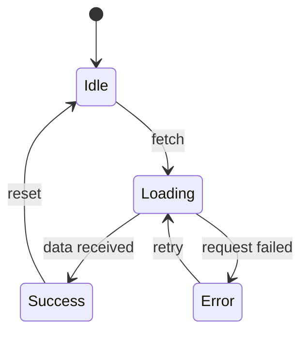

# Spec: {feature-name}

id: S-{NNN}
version: 1.0
status: draft | active | deprecated | archived
journey: J-{NNN}
tests: [T-{NNN}, T-{NNN}]
components: [{Component.tsx}, ...]
date: {YYYY-MM-DD}

---

## Summary

**One-liner**: {What this feature does in one sentence}

**Why**: {Link to user journey, why this exists}

---

## User Story

As a {actor}
I want to {action}
So that {outcome}

---

## Interface Contract

### Props / Inputs

| Prop | Type | Required | Default | Description |
|------|------|----------|---------|-------------|
| {prop} | {type} | {yes/no} | {value} | {what it does} |

### State

| State | Type | Initial | Description |
|-------|------|---------|-------------|
| {state} | {type} | {value} | {what it tracks} |

### Events / Outputs

| Event | Payload | When |
|-------|---------|------|
| {event} | {type} | {trigger condition} |

---

## Component Breakdown

```
{ParentComponent}
├── {ChildComponent}
│   ├── {Subcomponent}
│   └── {Subcomponent}
└── {ChildComponent}
```

| Component | Responsibility | Props |
|-----------|---------------|-------|
| {name} | {what it does} | {key props} |

---

## State Machine



| State | Entry Action | Exit Action |
|-------|--------------|-------------|
| Idle | Clear data | - |
| Loading | Show skeleton | - |
| Success | Render data | - |
| Error | Show error banner | Clear error |

---

## Visual Reference

### Figma Source (if applicable)

| Field | Value |
|-------|-------|
| File URL | {Figma URL or "N/A"} |
| Frame/Node ID | {node ID or "N/A"} |
| Last Synced | {date or "N/A"} |

### Reference Screenshots

| Breakpoint | Screenshot | Notes |
|------------|------------|-------|
| Desktop (1440px) |  | {notes} |
| Tablet (768px) |  | {notes} |
| Mobile (320px) |  | {notes} |

### Visual Acceptance Criteria

- [ ] Layout matches reference at all breakpoints (within 4px)
- [ ] Colors use tokens from tokens.md (no hardcoded hex)
- [ ] Typography uses defined font stack
- [ ] Spacing aligns with spacing scale
- [ ] Touch targets >= 44px on mobile

---

## API Shape

### Endpoints Used

| Method | Endpoint | Request | Response |
|--------|----------|---------|----------|
| GET | {path} | {params} | {shape} |
| POST | {path} | {body} | {shape} |

### Example Request/Response

```json
// Request
{
  "field": "value"
}

// Response
{
  "data": {...}
}
```

---

## Accessibility Requirements

- [ ] Keyboard navigable (Tab, Enter, Escape)
- [ ] Focus management (trapped in modals, restored on close)
- [ ] Screen reader announcements for dynamic content
- [ ] Color contrast meets WCAG 2.1 AA (4.5:1 text, 3:1 UI)
- [ ] Reduced motion respected
- [ ] {specific requirements for this feature}

---

## Error Handling

| Error Condition | User Sees | System Does |
|-----------------|-----------|-------------|
| Network failure | "Couldn't connect. Check your connection." | Retry with backoff |
| 404 | "Not found" | Redirect to parent |
| 500 | "Something went wrong. Try again." | Log error, show retry |
| Validation | Inline field errors | Prevent submission |

---

## Performance Requirements

| Metric | Target | Measurement |
|--------|--------|-------------|
| Render time | <{X}ms | React Profiler |
| API response | <{X}ms | Network timing |
| Bundle contribution | <{X}KB | Build analysis |

---

## Definition of Done

### Functional
- [ ] {specific acceptance criterion}
- [ ] {specific acceptance criterion}
- [ ] {specific acceptance criterion}

### Non-Functional
- [ ] Performance targets met
- [ ] Accessibility requirements pass
- [ ] Error states implemented

### Quality Gates (LLM Judge)
- [ ] {quality criterion} — evaluated by LLM
- [ ] {quality criterion} — evaluated by LLM

### Validation
- [ ] Used in real scenario
- [ ] No "that's annoying" moment
- [ ] No regression in related features

---

## Out of Scope

Things explicitly NOT included in this spec:

- ❌ {feature/behavior not included}
- ❌ {feature/behavior not included}

---

## Open Questions

| Question | Status | Decision |
|----------|--------|----------|
| {question} | open / resolved | {answer if resolved} |

---

## Changelog

| Version | Date | Change | Why |
|---------|------|--------|-----|
| 1.0 | {date} | Initial spec | From J-{NNN} |

---

## Deprecated Behaviors

Things that USED to be true but aren't anymore:

| Removed | Version | Why |
|---------|---------|-----|
| {behavior} | {version} | {rationale} |
